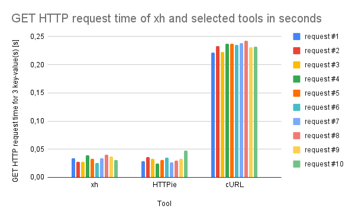
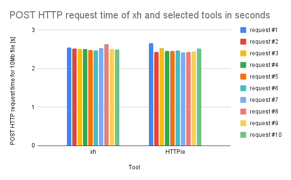

# Performance tests

## Environment setup

First, make sure that you have `npm` installed. To do that, run:

```bash
npm -v
```
If it is not there, follow official `npm` instructions at [https://docs.npmjs.com/downloading-and-installing-node-js-and-npm](https://docs.npmjs.com/downloading-and-installing-node-js-and-npm)

Install [typicode/json-server](https://github.com/typicode/json-server) using:

```bash
npm install -g json-server
```

Prepare a test JSON file that will be used for HTTP requests in REST API.

Now, start the server using:

```bash
json-server --watch <JSON file>
```

Go to `http://localhost:3000/<one of JSON file keys>` to check if the REST API is accessible.

### xh setup

via `cURL`

```bash
curl -sfL https://raw.githubusercontent.com/ducaale/xh/master/install.sh | sh
```
via Powershell

```
iwr -useb https://raw.githubusercontent.com/ducaale/xh/master/install.ps1 | iex
```

### httpie setup

```bash
<apt/brew/choco/pip/port/snap/yum> install httpie
```

### cURL setup

If you have a Unix-based operating system, Windows 10, version 1803, or later then you should already have `cURL` installed.

In other cases, follow [https://curl.se/download.html](https://curl.se/download.html)

## Total request time tests

### JSON file used for REST API in the following tests

`rest-api.json`
```json
{
  "posts": [
    { "id": 1, "title": "json-server", "author": "typicode" }
  ],
  "comments": [
    { "id": 1, "body": "some comment", "postId": 1 }
  ],
  "profile": { "name": "typicode" },
  "files": []
}
```

### Methodology

Total times of 10 HTTP requests are collected for `xh` and at least one other selected tool.

GET HTTP requests times are checked against `posts` of `rest-api.json`.

POST HTTP requests are checked against `files` of `rest-api.json`, using a key-value pair, where the key is a "file" string and the value is a 10Mb .db file.

The time average of the aforementioned 10 requests is used to compare performance.

#### xh and HTTPie

Total request times are checked using `--meta` flag.

#### cURL

Total request time is checked using:

```bash
curl.exe -o /dev/null -s -w 'Elapsed time: %{time_total}s\n' <HTTP address>
```
-w 'Elapsed time: %{time_total}s\n' tells `cURL` how to format its response

-o /dev/null redirects the output of the request to /dev/null

-s tells `cURL` not to show a progress meter

This substitutes for `--meta` flag that is absent from `cURL`.

### GET http://localhost:3000/posts

```bash
xh --meta get http://localhost:3000/posts
```

```bash
http --meta get http://localhost:3000/posts
```

```bash
curl.exe -o /dev/null -s -w 'Elapsed time: %{time_total}s\n' http://localhost:3000/posts
```

| request no.  |  xh [s] | HTTPie [s]  | cURL [s]  |
|---|---|---|---|
| 1  | 0,03425 | 0,029061 | 0,221511 |
| 2  | 0,0281  | 0,036488 | 0,233071 |
| 3  | 0,02738 | 0,033274 | 0,223138 |
| 4  | 0,03969 | 0,024243 | 0,237104 |
| 5  | 0,03336 | 0,031067 | 0,236876 |
| 6  | 0,02552 | 0,035321 | 0,235596 |
| 7  | 0,03398 | 0,027095 | 0,238727 |
| 8  | 0,04022 | 0,029823 | 0,242501 |
| 9  | 0,03689 | 0,032821 | 0,230848 |
| 10 | 0,03061 | 0,047444 | 0,231826 |
| average | 0,033 | 0,0326637 | 0,2331198 |



### POST http://localhost:3000/files file=@10Mb.db

\* it may be required to change `json-server` request size limit

\* `cURL` does not possess the ability to post key-file pairs, so it will be excluded from this performance test

```bash
xh --meta --form post http://localhost:3000/files file=@10Mb.db
```

```bash
http --meta --form post http://localhost:3000/files file=@10Mb.db
```

| request no.  |  xh [s] | HTTPie [s]  |
|---|---|---|
| 1  | 2,54698 | 2,656966 |
| 2  | 2,52166 | 2,436937 |
| 3  | 2,5141  | 2,532528 |
| 4  | 2,50832 | 2,461681 |
| 5  | 2,48469 | 2,459782 |
| 6  | 2,4754  | 2,47116  |
| 7  | 2,53072 | 2,41616  |
| 8  | 2,62968 | 2,427871 |
| 9  | 2,50804 | 2,440089 |
| 10 | 2,49537 | 2,518192 |
| average | 2,521496 | 2,4821366 |


